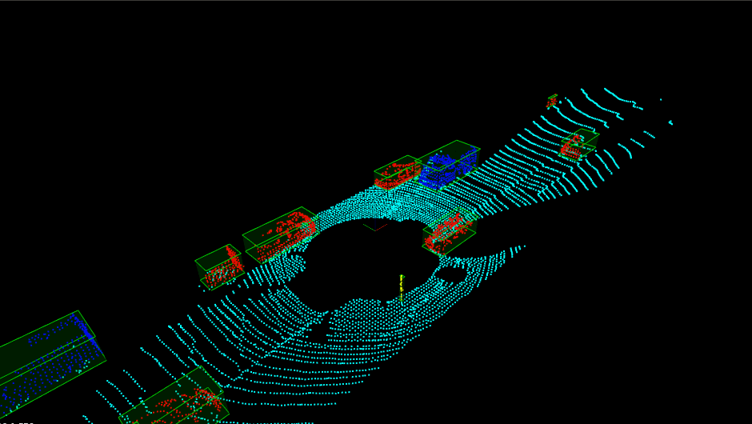
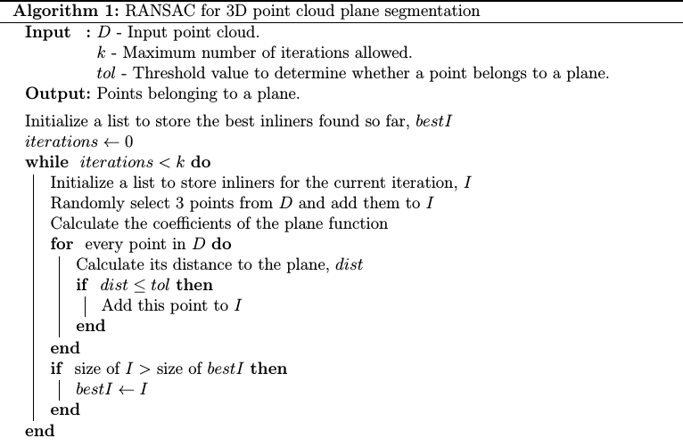
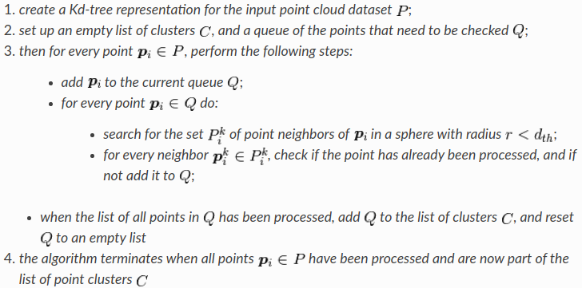
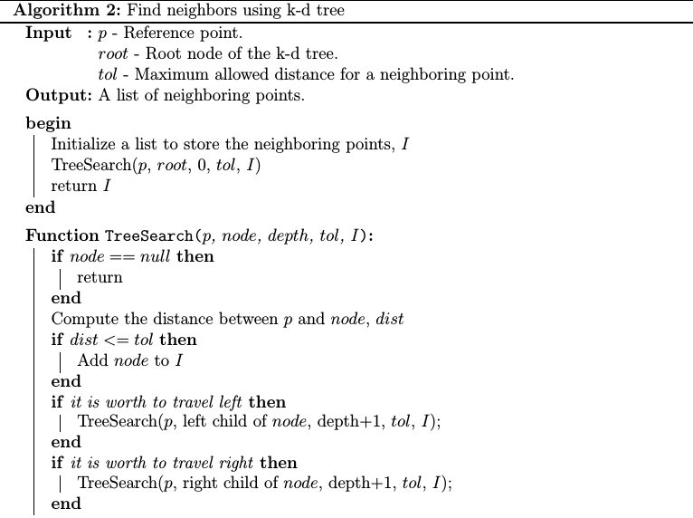

# LIDAR Obstacle Detection




## Dependencies

### Ubuntu 

One can build and install `VTK` and `PCL` from source. This is what I did.

```shell script
# Prerequisite
sudo apt install build-essential libgl1-mesa-dev libglu1-mesa-dev
sudo apt install libflann-dev libboost-all-dev libeigen3-dev 

# Build and install VTK
git clone --branch v8.2.0 https://github.com/Kitware/VTK.git
cd VTK
mkdir build && cd build
cmake -DCMAKE_BUILD_TYPE=Release -DBUILD_TESTING=OFF ../
make -j4
sudo make install

# Build and install PCL
git clone --branch pcl-1.9.1 https://github.com/PointCloudLibrary/pcl.git
cd pcl
mkdir build && cd build
cmake -DCMAKE_BUILD_TYPE=Release -DBUILD_visualization=ON ../
make -j4
sudo make install
```

Alternatively, one could simply do

```shell
sudo apt install libpcl-dev
```

### Mac

```shell
brew install pcl
```


## Data

The original point cloud data can be found [here](https://github.com/udacity/SFND_Lidar_Obstacle_Detection/tree/master/src/sensors/data/pcd).
For this project, the data has been included as a submodule and one can simply download it together
with the repository by

```shell
git clone --recursive https://github.com/zhujun98/sensor-fusion.git
```

## Build and Run

```shell script
cd SFND_Lidar_Obstacle_Detection
mkdir build && cd build
cmake .. && make
./environment ../data/pcd/data_1
```

By default, the project uses the in-house implementations for point cloud
segmentation and clustering. To switch to the [PCL](http://pointclouds.org/)
implementation, build the project with:

```shell script
cmake .. -DUSE_PCL_SEG=ON -DUSE_PCL_CLUSTER=ON && make
```

## Algorithms

### RANSAC for plane segmentation

RANSAC (**RAN**dom **SA**mple **C**onsensus) is an iterative method to estimate parameters of a 
mathematical model from a set of observed data that contains significant outliers.



### k-d tree for Euclidean cluster extraction

A `k-d tree` (**k**-**d**imensional tree) is a space partitioning data structure for organizing
points in a k-dimensional space. Assuming that we have a `k-d tree` structure for searching the 
neighbors within a distance, the algorithmic steps for that would be:



For more details, one can see 
[here](https://pcl.readthedocs.io/projects/tutorials/en/latest/cluster_extraction.html#cluster-extraction).

The algorithm of searching for neighbors in a `k-d tree` would be:


